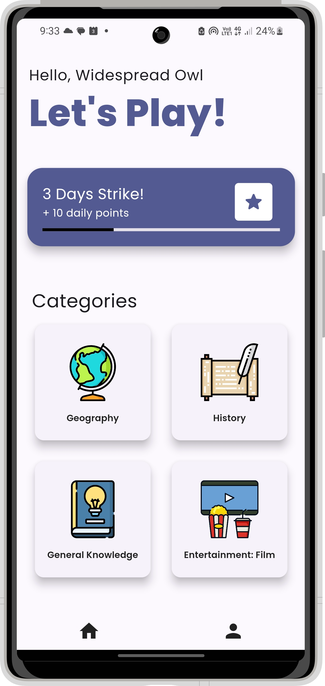
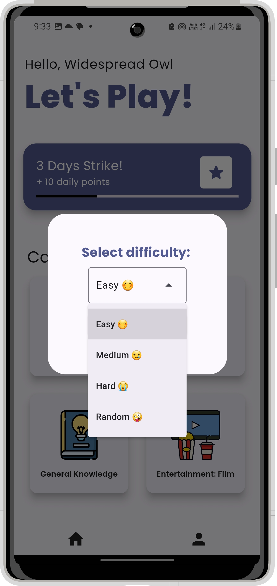
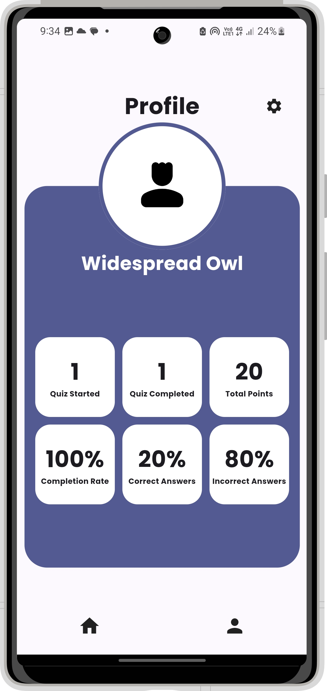

# QUIZZIT
()

## Introduction

Our project was inspired by the need to help people practice for quizzes and exams effectively while gaining knowledge. We noticed that many individuals struggle with traditional study methods and wanted to create an interactive solution. Our quiz app allows users to test their knowledge, identify areas for improvement, and make learning enjoyable.
- [Deployed Site](https://quizzit.thedreamcatcher.dev/)
- [Final Project Blog Article](https://your-blog-article-url.com)
- Authors Linkedin
  - [Abdulrhman Mohammed](https://www.linkedin.com/in/abduhany/)
  - [Salsabil Ahmed](https://www.linkedin.com/in/salsabil-ahmed-642a77287/)
  - [Shenouda Mikhael](https://www.linkedin.com/in/shenoudamikhael/)

## Features
- Choose from different categories which are always up-to-date.
- Select your level of difficulty for personalized content.
- Track your progress and monitor improvements over time.

## Installation
 
Install [**Quizzit**](https://play.google.com/store/apps/details?id=dev.thedreamcatcher.quizzit) Where every question is an adventure!

## Dependencies

- **`flutter`** - Flutter SDK
- **`cupertino_icons: ^1.0.2`** - iOS style icons
- **`google_fonts: ^5.1.0`** - Google Fonts for custom fonts
- **`dio: ^5.4.3+1`** - HTTP requests package for API service
- **`rive: ^0.13.8`** - Rive animation in splash screen
- **`path_provider: ^2.1.3`** - To get quiz file path
- **`unique_name_generator: ^1.0.0`** - For generating unique names
- **`share_plus: ^9.0.0`** - For share button in results page

## Usage
#### Choosing a Category
- Browse through the available categories and choose one that interests you.
#### Selecting a Difficulty Level
- After selecting a category, you will be prompted to choose your level of difficulty.
- Select the difficulty level that suits your experience.
#### Tracking Your Progress
- Navigate to the "Profile" tab.
- View detailed statistics showing your performance over time.
#### Edit Your Profile
- Navigate to the "Profile" tab
- Tab "Settings" icon and choose "Edit Profile"
- You can edit your Name, Date of birth and Gender.

## Related Repositories
- [Backend Repository](https://github.com/ShenoudaMikhael/quizzit_backend) - This repository contains the backend code for our application.

## MIT License

Copyright (c) 2024 Abduhany
Copyright (c) 2024 Salsapil
Copyright (c) 2024 ShenoudaMikhael

Permission is hereby granted, free of charge, to any person obtaining a copy
of this software and associated documentation files (the "Software"), to deal
in the Software without restriction, including without limitation the rights
to use, copy, modify, merge, publish, distribute, sublicense, and/or sell
copies of the Software, and to permit persons to whom the Software is
furnished to do so, subject to the following conditions:

The above copyright notice and this permission notice shall be included in all
copies or substantial portions of the Software.

THE SOFTWARE IS PROVIDED "AS IS", WITHOUT WARRANTY OF ANY KIND, EXPRESS OR
IMPLIED, INCLUDING BUT NOT LIMITED TO THE WARRANTIES OF MERCHANTABILITY,
FITNESS FOR A PARTICULAR PURPOSE AND NONINFRINGEMENT. IN NO EVENT SHALL THE
AUTHORS OR COPYRIGHT HOLDERS BE LIABLE FOR ANY CLAIM, DAMAGES OR OTHER
LIABILITY, WHETHER IN AN ACTION OF CONTRACT, TORT OR OTHERWISE, ARISING FROM,
OUT OF OR IN CONNECTION WITH THE SOFTWARE OR THE USE OR OTHER DEALINGS IN THE
SOFTWARE.

## Screenshot

    
    
    

## Authors GitHub

- [@AbdelrahmanMetawei](https://github.com/Abduhany/)
- [@SalsabilAhmed](https://github.com/Salsapil)
- [@ShenoudaMikhael](https://github.com/ShenoudaMikhael)